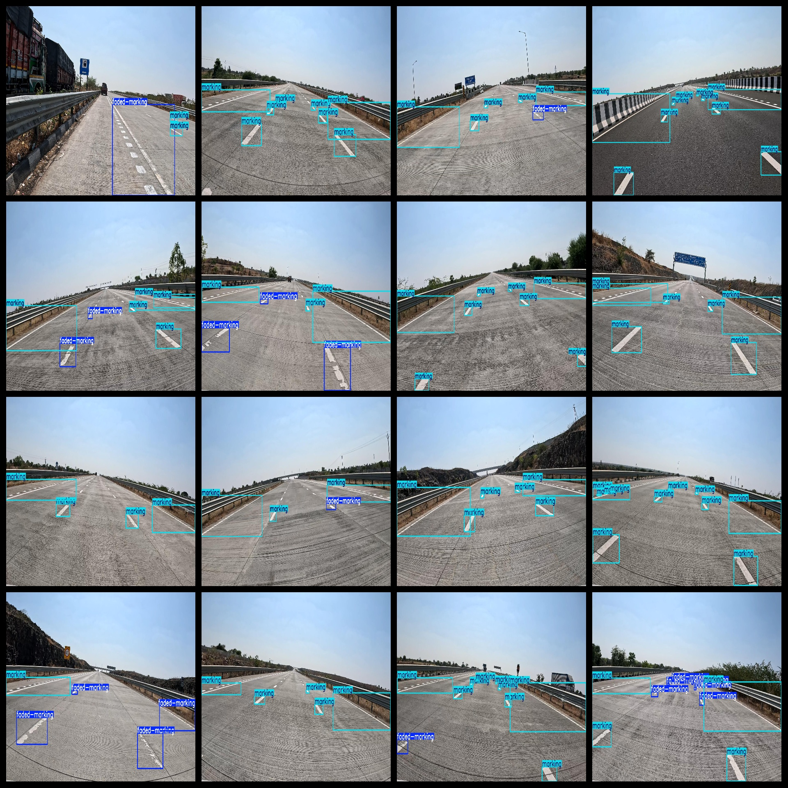

# In-Vehicle View Road Surface Marking Fading Dataset 4083 images VOC+YOLO format

This dataset contains images taken from the inside of a vehicle showing road marking fading. It is organized in Pascal VOC format + YOLO format, without the split path for txt files and only containing jpg images along with their corresponding VOC format xml files and yolo format txt files.

Number of images (jpg file count): 4083

Number of annotations (xml file count): 4083

Number of annotations (txt file count): 4083

Number of annotation categories: 2

Repository where the dataset can be found: datasets_sl

Annotation category names according to the labels folder's classes.txt file: ["faded-marking", "marking"]

Number of bounding boxes per category:

Faded-marking bounding box count = 2962

Marking bounding box count = 24834

Total bounding box count = 27796

Number of images per category:

Faded-marking image count = 1441

Marking image count = 4062

Image resolution: 2048x1152

Used labeling tool: labelImg

Dataset enhancement status: No

Annotation rules: Draw bounding boxes around categories

Important Notice: The dataset does not have been split into training, validation, or testing sets; you will need to do that yourself.

Special Declaration: This dataset does not guarantee any accuracy in the trained models or weight files.

Annotation and Image Conditions:

Annotation and Image Conditions:

## Images

---

Here is a pay link on Stripe (https://buy.stripe.com/3cs8yP7sY87d0vu9AB). Please contact me lonlonago@foxmail.com after funding $89, and I will send you a complete data files, thank you!

